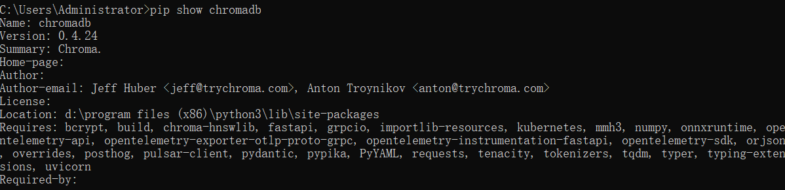
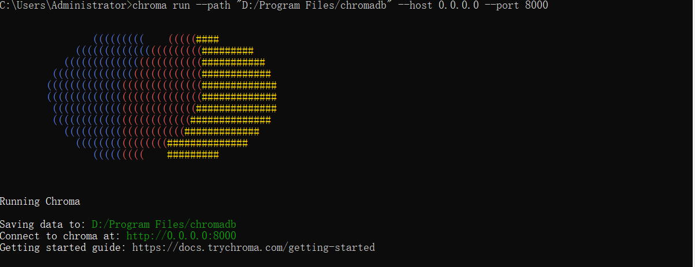
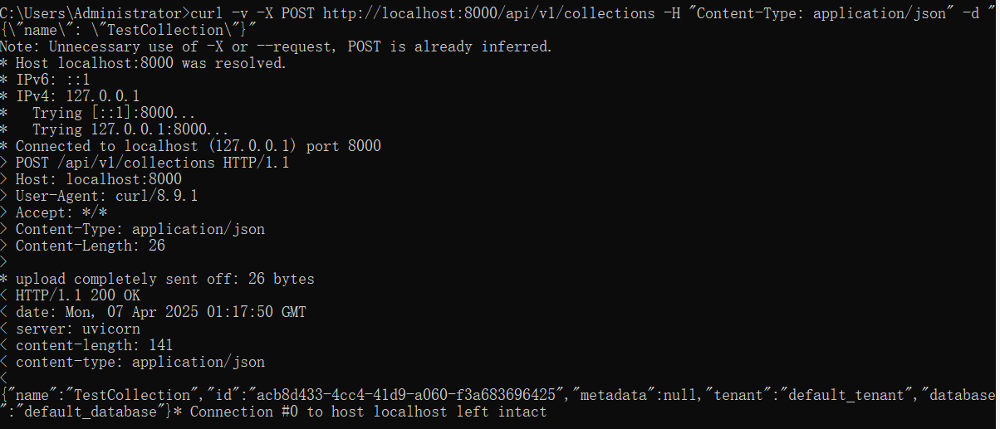

# 本地安装chromadb:

pip install chromadb

# 检查 Chroma 是否安装成功：
pip show chromadb  
安装完成如下：

# 启动运行Chroma：

chroma run --path "D:/Program Files/chromadb" --host 0.0.0.0 --port 8000

--path：指定数据库持久化存储路径（必填）
--host：默认localhost，若需外部访问可设为0.0.0.0
--port：默认端口8000，可自定义

# 启动成功如下：

# 创建collection

若已启动 Chroma 服务（chroma run），可直接调用其 REST API 创建集合：

## 创建名为 "TestCollection" 的集合

curl -v -X POST http://localhost:8000/api/v2/collections -H "Content-Type: application/json" -d "{\"name\": \"TestCollection\"}"

## 查询名为 "TestCollection" 的集合
curl -X GET http://localhost:8000/api/v1/collections/TestCollection

## 删除名为 "TestCollection" 的集合
curl -X DELETE http://localhost:8000/api/v1/collections/TestCollection

注意: 高版本的spring ai 比如1.0.0版本只支持v2版不的API，低版本的spring ai 才支持v1版本的API