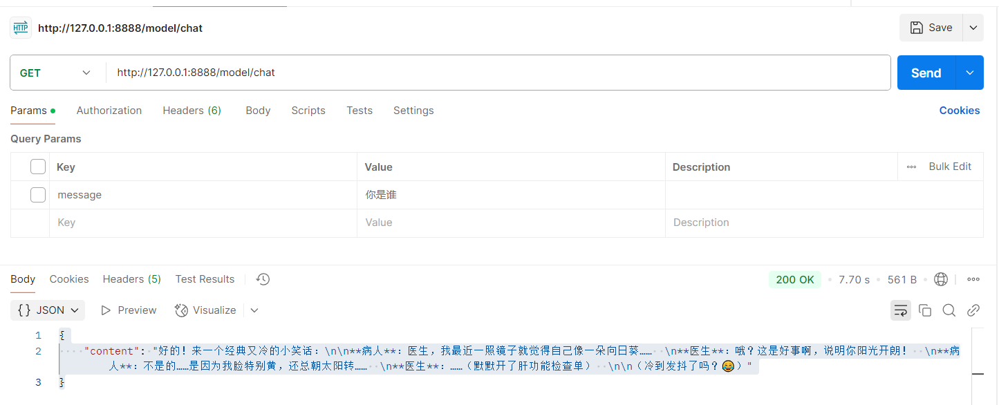
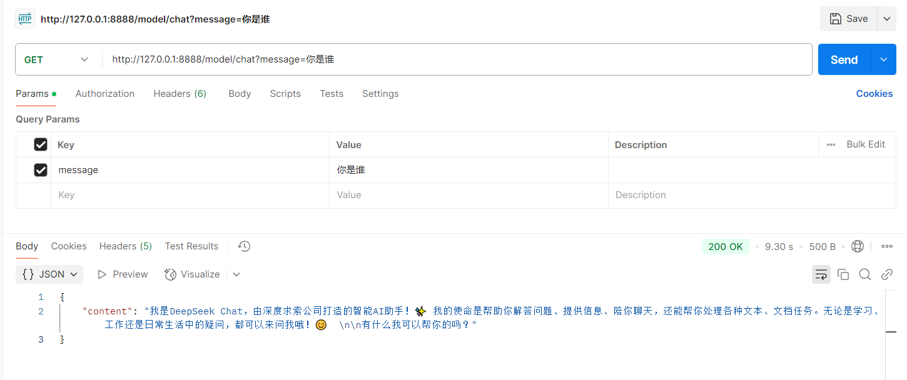

# 前言
基于spring ai框架，完成deepseek对话聊天服务开发

# 概述
目前spring ai项目中支持deepseek的调用，可以使用openAI的风格进行接口调用测试

# 一、引入spring-ai相关依赖
配置spring-ai依赖
```xml
<dependencyManagement>
        <dependencies>
            <dependency>
                <groupId>org.springframework.ai</groupId>
                <artifactId>spring-ai-bom</artifactId>
                <version>1.0.0</version>
                <type>pom</type>
                <scope>import</scope>
            </dependency>
        </dependencies>
    </dependencyManagement>
```
配置spring-ai-openai相关依赖
```xml

<dependency>
            <groupId>org.springframework.ai</groupId>
            <artifactId>spring-ai-starter-model-openai</artifactId>
            <version>${spring-ai.version}</version>
        </dependency>
```

# 二、deepseek chat对话核心代码
```java
package com.spring.ai.deepseek.controller;


import org.springframework.ai.chat.messages.UserMessage;
import org.springframework.ai.chat.model.ChatResponse;
import org.springframework.ai.chat.prompt.Prompt;
import org.springframework.ai.openai.OpenAiChatModel;
import org.springframework.beans.factory.annotation.Autowired;
import org.springframework.web.bind.annotation.GetMapping;
import org.springframework.web.bind.annotation.RequestParam;
import org.springframework.web.bind.annotation.RestController;
import reactor.core.publisher.Flux;

import java.util.Map;


@RestController
public class ChatController {

    private final OpenAiChatModel chatModel;

    @Autowired
    public ChatController(OpenAiChatModel chatModel) {
        this.chatModel = chatModel;
    }

    @GetMapping("/ai/generate")
    public Map generate(@RequestParam(value = "message", defaultValue = "给我讲一个笑话") String message) {
        return Map.of("generation", this.chatModel.call(message));
    }

    @GetMapping("/ai/generateStream")
    public Flux<ChatResponse> generateStream(@RequestParam(value = "message", defaultValue = "给我讲一个笑话") String message) {
        Prompt prompt = new Prompt(new UserMessage(message));
        return this.chatModel.stream(prompt);
    }
}
```
# 三、配置yml文件（配置deepseek API信息）
这里我将apk key配置在了本地电脑环境变量中DEEPSEEK_API_KEY
```yml
server:
  port: 8888
spring:
  ai:
    openai:
      api-key: ${DEEPSEEK_API_KEY}
      base-url: https://api.deepseek.com
      chat:
        options:
          model: deepseek-chat
          temperature: 0.7
```
# 四、启动SpringBoot程序
启动服务后即可访问yml中配置的端口
server:
    port: 8888

# 五、API调用测试
我这里使用postman进行API对话测试，
## 第一轮对话测试：

GET请求地址：http://127.0.0.1:8888/model/chat

模型返回内容：
```json
{
  "content": "好的！来一个经典又冷的小笑话：\n\n**病人**：医生，我最近一照镜子就觉得自己像一朵向日葵……  \n**医生**：哦？这是好事啊，说明你阳光开朗！  \n**病人**：不是的……是因为我脸特别黄，还总朝太阳转……  \n**医生**：……（默默开了肝功能检查单）  \n\n（冷到发抖了吗？😂）"
}
```
测试效果截图如下：


## 第二轮对话测试：（携带参数）

GET请求地址：http://127.0.0.1:8888/model/chat?message=你是谁

模型返回内容：
```json
{
  "generation": "我是DeepSeek Chat，由深度求索公司（DeepSeek）创造的智能AI助手！🤖✨ 我的使命是帮助你解答各种问题，无论是学习、工作，还是日常生活中的小困惑，我都会尽力提供准确、有用的信息。  \n\n有什么我可以帮你的吗？😊"
}
```
测试效果截图如下：



# 六、常见问题
1. 调用deepseek api  实如果报错如下,请检查保证 api key配置正确
Caused by: java.net.HttpRetryException: cannot retry due to server authentication, in streaming mode