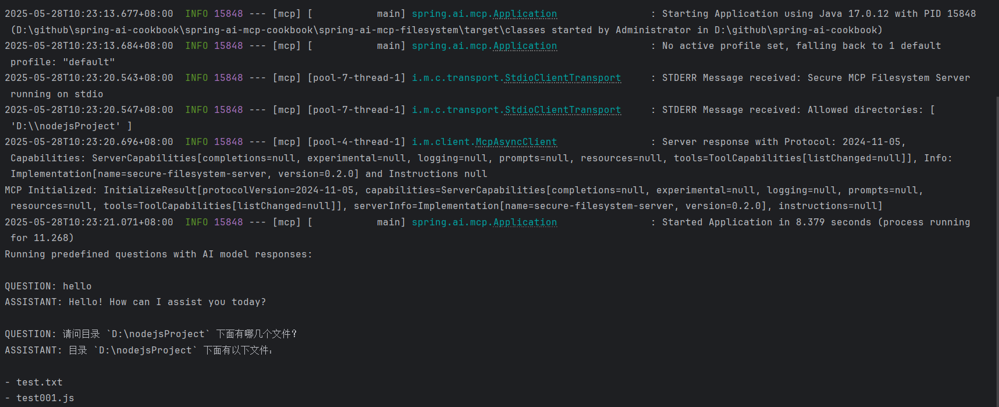

# Spring AI 模型上下文协议演示应用

这是一个展示如何通过 **模型上下文协议 (MCP)** 将 Spring AI 与本地文件系统集成的示例应用。  
它支持使用自然语言对本地文件系统中的预定义目录进行交互。

该应用会启动并连接到 [Filesystem MCP-Server](https://github.com/modelcontextprotocol/servers/tree/main/src/filesystem)，并访问你本地的 `model-context-protocol/filesystem/target` 目录。

## 功能特性

- 使用自然语言查询和更新本地文件系统中的文件
- 支持预设问题模式，自动分析目录内容
- 无缝集成 OpenAI 的大语言模型
- 基于 Spring AI 和模型上下文协议构建

## 环境要求

- Java 17 或更高版本
- Maven 3.6+
- npx 包管理器
- Git
- OpenAI API 密钥

## 安装步骤

1. 安装 npx（Node Package eXecute）：
   首先确保已安装 [npm]，然后运行：
   ```bash
   npm -v
   ```


2. 克隆仓库：
   ```bash
   git clone https://github.com/spring-projects/spring-ai-examples.git
   cd model-context-protocol/filesystem
   ```


3. 设置你的 OpenAI API 密钥：
   ```bash
   export OPENAI_API_KEY='your-api-key-here'
   ```


4. 构建项目：
   ```bash
   mvn clean package
   ```


## 创建一个示例文本文件用于测试

在 `filesystem/target` 目录下手动创建一个 `spring-ai-mcp-overview.txt` 文件，或使用脚本 `create-text-file.sh` 自动创建。

## 运行应用

### 使用预设问题模式运行：

```bash
java -jar spring-ai-filesystem-demo-0.0.1-SNAPSHOT.jar
```
启动输出


## 架构概览

Spring AI 与 MCP 的集成由以下组件组成：

1. **MCP 客户端**：提供与文件系统的通信基础层
2. **函数回调**：将文件系统操作封装为 AI 可调用的函数
3. **聊天客户端**：将这些函数连接到 AI 模型

下面将详细说明这些 Bean 的定义。

### 聊天客户端 (`ChatClient`)

```java
@Bean
@Profile("!chat")
public CommandLineRunner predefinedQuestions(ChatClient.Builder chatClientBuilder,
                                           List<McpFunctionCallback> functionCallbacks,
                                           ConfigurableApplicationContext context) {
    return args -> {
        var chatClient = chatClientBuilder.defaultFunctions(functionCallbacks)
                .build();
        // 执行预设问题逻辑
    };
}
```


该客户端只需传入从 MCP 工具自动生成的函数回调即可完成初始化。Spring 的依赖注入机制负责所有底层配置，使整个集成过程简洁流畅。

### 函数回调 (`McpFunctionCallback`)

```java
@Bean
public List<McpFunctionCallback> functionCallbacks(McpSyncClient mcpClient) {
    return mcpClient.listTools(null)
            .tools()
            .stream()
            .map(tool -> new McpFunctionCallback(mcpClient, tool))
            .toList();
}
```


#### 作用

该 Bean 负责：

1. 从 MCP 服务器发现可用工具
2. 将每个工具转换为 Spring AI 的函数回调
3. 提供给 `ChatClient` 使用

#### 工作原理

1. `mcpClient.listTools(null)` 查询 MCP 服务器的所有可用工具
   - 参数 `null` 表示分页游标，当为 null 时返回第一页结果
2. `.tools()` 提取响应中的工具列表
3. 每个工具通过 `.map()` 转换为 `McpFunctionCallback`
4. 最终收集为列表并返回

#### 应用场景

注册的回调使 `ChatClient` 能够：

- 在对话过程中访问 MCP 工具
- 处理 AI 模型请求的函数调用
- 对 MCP 服务器执行工具操作（如文件系统）

### MCP 客户端 ([McpSyncClient]

```java
@Bean(destroyMethod = "close")
public McpSyncClient mcpClient() {
    var stdioParams = ServerParameters.builder("npx")
            .args("-y", "@modelcontextprotocol/server-filesystem", getDbPath())
            .build();

    var mcpClient = McpClient.sync(new StdioServerTransport(stdioParams),
            Duration.ofSeconds(10), new ObjectMapper());

    var init = mcpClient.initialize();
    System.out.println("MCP 初始化成功: " + init);

    return mcpClient;
}
```


该配置：

1. 创建基于标准输入输出的传输层，连接 `npx` 启动的 MCP 服务
2. 指定文件系统服务器使用的目录路径
3. 设置操作超时时间为 10 秒
4. 使用 Jackson 进行 JSON 序列化
5. 初始化与 MCP 服务器的连接

`destroyMethod = "close"` 注解确保应用关闭时能正确释放资源。

---