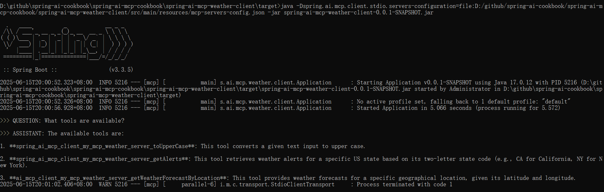
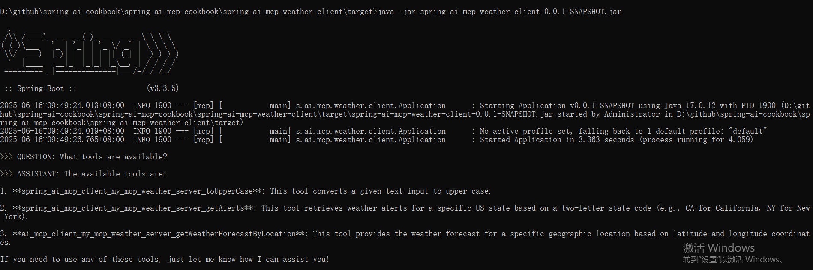
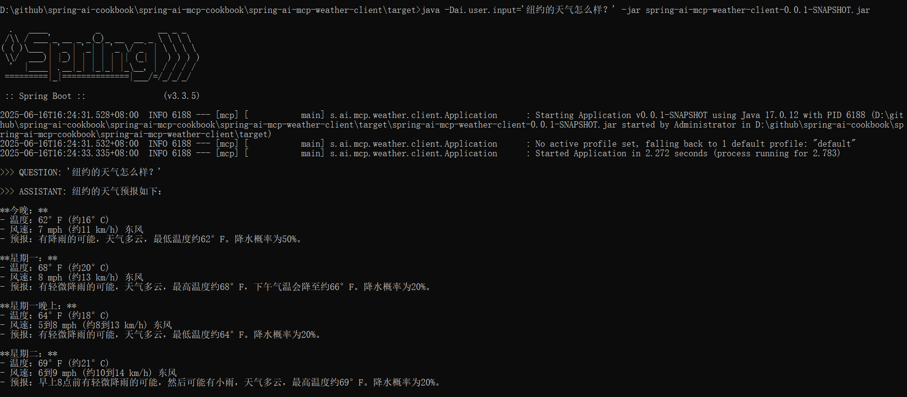

# Spring AI MCP 天气服务器示例

本示例项目演示了如何使用 **Spring AI MCP Server Boot Starter** 结合 **WebMVC 传输协议** 创建一个 MCP 服务器。该项目实现了一个天气服务，通过美国国家气象局 API 提供获取天气信息的工具。

## 概述

此项目展示了以下功能：
- 集成 `spring-ai-mcp-server-webmvc-spring-boot-starter`
- 支持 **SSE (Server-Sent Events)** 和 **STDIO** 两种传输方式
- 使用 Spring AI 的 `@Tool` 注解自动注册工具
- 提供两个与天气相关的工具：
  - 根据经纬度获取天气预报
  - 根据美国州代码获取天气警报

## 依赖项

项目需要以下 Maven 依赖：

```xml
<dependency>
    <groupId>org.springframework.ai</groupId>
    <artifactId>spring-ai-mcp-server-webmvc-spring-boot-starter</artifactId>
</dependency>
```


该启动器提供：
- 基于 HTTP 的传输（使用 `WebMvcSseServerTransport`）
- 自动配置的 SSE 端点
- 可选的 STDIO 传输支持
- 包含 `spring-boot-starter-web` 和 `mcp-spring-webmvc` 依赖

## 构建项目

使用 Maven 构建项目：

```bash
mvn clean install -DskipTests
```


## 运行服务器

服务器支持两种传输模式：

### WebMVC SSE 模式（默认）
```bash
java -jar target/spring-ai-mcp-weather-server-0.0.1-SNAPSHOT.jar
```


### STDIO 模式
启用 STDIO 传输时，需设置如下参数：
```bash
java -Dspring.ai.mcp.server.stdio=true -Dspring.main.web-application-type=none -jar target/spring-ai-mcp-weather-server-0.0.1-SNAPSHOT.jar
```


## 配置

通过 [application.properties]

```properties
# 服务器标识
spring.ai.mcp.server.name=my-weather-server
spring.ai.mcp.server.version=0.0.1

# 服务器类型（同步/异步）
spring.ai.mcp.server.type=SYNC

# 传输配置
spring.ai.mcp.server.stdio=false
spring.ai.mcp.server.sse-message-endpoint=/mcp/message

# 变更通知
spring.ai.mcp.server.resource-change-notification=true
spring.ai.mcp.server.tool-change-notification=true
spring.ai.mcp.server.prompt-change-notification=true

# 日志（STDIO 模式必需）
spring.main.banner-mode=off
logging.file.name=./target/spring-ai-mcp-weather-server.log
```


## 可用工具

### 天气预报工具
- 名称：`getWeatherForecastByLocation`
- 描述：根据指定的纬度和经度获取天气预报
- 参数：
  - `latitude`: double 类型，表示纬度
  - `longitude`: double 类型，表示经度

### 天气警报工具
- 名称：`getAlerts`
- 描述：获取某个美国州的天气警报信息
- 参数：
  - `state`: 字符串类型，表示两位数的州代码（如 CA、NY）

## 服务器实现

服务器使用 Spring Boot 和 Spring AI 的 `@Tool` 注解来自动注册工具：

```java
@SpringBootApplication
public class Application {
    public static void main(String[] args) {
        SpringApplication.run(Application.class, args);
    }

    @Bean
    public ToolCallbackProvider weatherTools(WeatherService weatherService){
      return MethodToolCallbackProvider.builder().toolObjects(weatherService).build();
    }
}
```


`WeatherService` 类中使用 `@Tool` 注解实现具体工具方法：

```java
@Service
public class WeatherService {
    @Tool(description = "Get weather forecast for a specific latitude/longitude")
    public String getWeatherForecastByLocation(double latitude, double longitude) {
        // 调用 weather.gov API 实现逻辑
    }

    @Tool(description = "Get weather alerts for a US state. Input is Two-letter US state code (e.g., CA, NY)")
    public String getAlerts(String state) {
        // 调用 weather.gov API 实现逻辑
    }
}
```


## MCP 客户端连接方式

你可以通过以下两种方式连接到天气服务器：
- **SSE (WebMVC)**
- **STDIO**

### 手动客户端示例

#### WebMVC SSE 客户端

适用于使用 SSE 传输的服务器：

```java
HttpClientSseClientTransport transport = HttpClientSseClientTransport.builder("http://localhost:8080").build();
McpSyncClient client = McpClient.sync(transport).build();
```
参考：spring-ai-mcp-weather-server\src\test\java\spring\ai\mcp\weather\client\ClientSse.java

#### STDIO 客户端

适用于使用 STDIO 传输的服务器：

```java
ServerParameters stdioParams = ServerParameters.builder("java")
    .args("-Dspring.ai.mcp.server.stdio=true",
          "-Dspring.main.web-application-type=none",
          "-Dspring.main.banner-mode=off",
          "-Dlogging.pattern.console=",
          "-jar",
          "target/spring-ai-mcp-weather-server-0.0.1-SNAPSHOT.jar")
    .build();

StdioClientTransport transport = new StdioClientTransport(stdioParams);
McpSyncClient client = McpClient.sync(transport).build();
```

参考：spring-ai-mcp-weather-server\src\test\java\spring\ai\mcp\weather\client\ClientStdio.java

### Boot Starter 客户端

可以参考 [spring-ai-mcp-weather-client]为例，连接到 `spring-ai-mcp-weather-server`。

请先按照 `spring-ai-mcp-weather-client` 的说明构建 `spring-ai-mcp-weather-client-0.0.1-SNAPSHOT.jar` 客户端应用。

#### STDIO 传输

参考： spring-ai-mcp-weather-client （直接运行java -jar spring-ai-mcp-weather-client-0.0.1-SNAPSHOT.jar）

1. 创建 [mcp-servers-config.json]
```json
{
  "mcpServers": {
    "my-mcp-weather-server": {
      "command": "java",
      "args": [
        "-Dspring.ai.mcp.server.stdio=true",
        "-Dspring.main.web-application-type=none",
        "-Dlogging.pattern.console=",
        "-jar",
        "/absolute/path/to/spring-ai-mcp-weather-server-0.0.1-SNAPSHOT.jar"
      ]
    }
  }
}
```


2. 在spring-ai-mcp-weather-client的properties中，使用 STDIO 传输启动客户端：

```bash
#使用stdio传输模式
spring.ai.mcp.client.stdio.servers-configuration=classpath:/mcp-servers-config.json
```

启动spring-ai-mcp-weather-client
使用命令：`java -jar spring-ai-mcp-weather-client-0.0.1-SNAPSHOT.jar`
启动客户端后，将看到以下输出：


参数参考：
```bash
java -Dspring.ai.mcp.client.stdio.servers-configuration=file:mcp-servers-config.json \
-Dai.user.input="What is the weather in NY?" \
-Dlogging.pattern.console= \
-jar spring-ai-mcp-weather-client-0.0.1-SNAPSHOT.jar
```


#### SSE (WebMVC) 传输

1. 启动 `spring-ai-mcp-weather-server`：

```bash
java -jar spring-ai-mcp-weather-server-0.0.1-SNAPSHOT.jar
```

该命令将在 8080 端口启动 MCP 服务器。

2. 在spring-ai-mcp-weather-client的properties中，使用 SSE 传输启动客户端：
```bash
#使用sse传输模式
spring.ai.mcp.client.sse.connections.my-mcp-weather-server.url=http://localhost:8080
```

启动spring-ai-mcp-weather-client
使用命令：`java -jar spring-ai-mcp-weather-client-0.0.1-SNAPSHOT.jar` 

启动客户端后，将看到以下输出：


参数参考：
```bash
java -Dspring.ai.mcp.client.sse.connections.my-mcp-weather-server.url=http://localhost:8080 \
-Dlogging.pattern.console= \
-Dai.user.input='What is the weather in NY?' \
-jar spring-ai-mcp-weather-client-0.0.1-SNAPSHOT.jar
```

问题提问测试：
```bash
java -Dai.user.input='纽约的天气怎么样？' -jar spring-ai-mcp-weather-client-0.0.1-SNAPSHOT.jar
```
