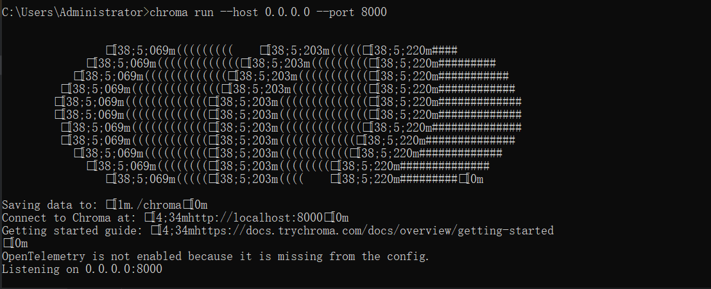
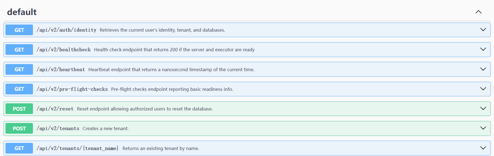

# 启动chromdb:

chroma run --host 0.0.0.0 --port 8000



# 查看API

http://localhost:8000/docs/




请求：
http://localhost:8080/ollama/chroma/vectorStore

响应：
```json

[
    {
        "id": "2bca3ddb-fcfc-4a0f-8131-32a7fc557b74",
        "text": "Spring AI rocks!! Spring AI rocks!! Spring AI rocks!! Spring AI rocks!! Spring AI rocks!!",
        "media": null,
        "metadata": {
            "distance": 0.30165958,
            "meta1": "meta1"
        },
        "score": 0.6983404159545898
    },
    {
        "id": "44da5085-7f88-41ee-8d85-a0cbaf1c69ec",
        "text": "You walk forward facing the past and you turn back toward the future.",
        "media": null,
        "metadata": {
            "distance": 0.50250506,
            "meta2": "meta2"
        },
        "score": 0.4974949359893799
    },
    {
        "id": "b2d87069-da2b-408e-9fcb-902c0c4e5ed1",
        "text": "The World is Big and Salvation Lurks Around the Corner",
        "media": null,
        "metadata": {
            "distance": 0.53833294
        },
        "score": 0.4616670608520508
    }
]
```


