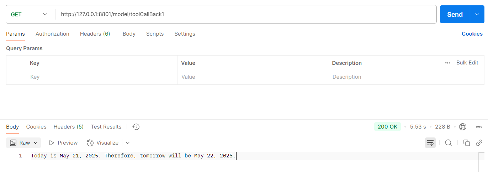
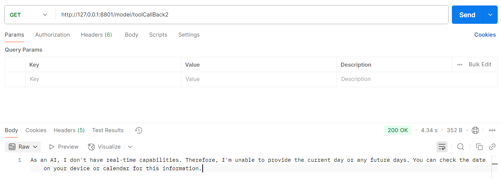

FunctionCallback 已经迁移到 ToolCallback API

# 一、信息检索类工具 （spring-ai-openai-toolCalling-example01）

信息检索。这类工具可用于从外部来源检索信息，例如数据库、Web 服务、文件系统或 Web 搜索引擎。
其目标是增强模型的知识，使其能够回答原本无法回答的问题。因此，它们可用于检索增强生成（RAG）场景中。
例如，可以使用工具检索给定位置当前的天气，检索最新的新闻文章，或查询数据库中的特定记录。

第一次请求：
http://127.0.0.1:8801/model/toolCallBack1
输出将会是类似这样的：
Today is May 21, 2025, so tomorrow will be May 22, 2025.

第二次请求： 同样的请求，只是不要向模型提供工具。输出将会是类似这样：
As an AI, I don't have real-time capabilities. Therefore, I'm unable to provide the current day or any future days. You can check the date on your device or calendar for this information.

翻译: "作为一个人工智能，我没有实时功能。因此，我无法提供今天的日期或任何未来的日期。你可以通过你的设备或日历来查看这个信息。

注：你会发现，没有工具，模型不知道如何回答问题，因为它没有确定当前日期和时间的能力。
